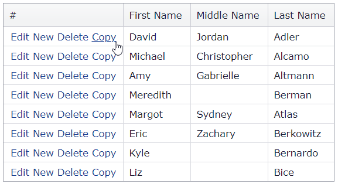

<!-- default badges list -->

[](https://supportcenter.devexpress.com/ticket/details/E4643)
[](https://docs.devexpress.com/GeneralInformation/403183)
[](#does-this-example-address-your-development-requirementsobjectives)
<!-- default badges end -->
# Grid View for ASP.NET MVC - How to implement row clone functionality

This example demonstrates how to create a custom **Copy** button that allows users to clone a grid row.



## Overview

Follow the steps below to implement the row clone functionality in the grid:

1. Create a custom **Copy** command button, handle the grid's client-side [CustomButtonClick](https://docs.devexpress.com/AspNet/js-ASPxClientGridView.CustomButtonClick) event, and do the following in the handler:
   * Pass the clicked row's visible index as a parameter to the grid's [GetRowKey](https://docs.devexpress.com/AspNet/js-ASPxClientGridView.GetRowKey(visibleIndex)) method to get the row's key value.
   * Call the grid's [PerformCallback](https://docs.devexpress.com/AspNet/js-ASPxClientGridView.PerformCallback(args)) method to send a callback to the server.

    ```cshtml
    settings.CommandColumn.CustomButtons.Add(new GridViewCommandColumnCustomButton() { ID = "btnCopy", Text = "Copy" });
    <!-- ... -->
    settings.ClientSideEvents.CustomButtonClick = "OnCustomButtonClick";
    ```

    ```js
    function OnCustomButtonClick(s, e) {
        rowKeyValueToCopy = s.GetRowKey(e.visibleIndex);
        s.PerformCallback();
    }
    ```

2. Handle the grid's client-side [BeginCallback](https://docs.devexpress.com/AspNet/js-ASPxClientGridView.BeginCallback) event and assign the row's key value to the `e.customArgs` argument property.

    ```js
    function OnBeginCallback(s, e) {
        if (e.command === "CUSTOMCALLBACK") {
            e.customArgs["key"] = rowKeyValueToCopy;
        }
    }
    ```

3. In an Action specified by the [CustomGridViewEditingPartial](https://docs.devexpress.com/AspNetMvc/DevExpress.Web.Mvc.GridSettingsBase.CustomActionRouteValues) property, pass the row's key value to the PartialView.

    ```cshtml
    settings.CustomActionRouteValues = new { Controller = "Home", Action = "CustomGridViewEditingPartial" };
    ```

    ```cs
    public ActionResult CustomGridViewEditingPartial(int key) {
        ViewData["key"] = key;
        return PartialView("_GridViewPartial", list.GetPersons());
    }
    ```

4. Handle the grid's [BeforeGetCallbackResult](https://docs.devexpress.com/AspNetMvc/DevExpress.Web.Mvc.GridSettingsBase.BeforeGetCallbackResult) event and call the grid's server-side [AddNewRow](https://docs.devexpress.com/AspNet/DevExpress.Web.ASPxGridView.AddNewRow) method to insert a row.

    ```cshtml
    settings.BeforeGetCallbackResult = (sender, e) => {
        if(needCreatCopy) {
            MVCxGridView gridView = (MVCxGridView)sender;
            gridView.AddNewRow();
        }
    };
    ```

5. Handle the grid's [InitNewRow](https://docs.devexpress.com/AspNetMvc/DevExpress.Web.Mvc.GridViewSettings.InitNewRow) event to copy the values of the clicked row to the inserted one.

    ```cshtml
    settings.InitNewRow = (sender, e) = {
        if (needCreatCopy) {
            object keyValue = ViewData["key"];
            MVCxGridView gridView = (MVCxGridView)sender;
            object[] rowValues = (object[])gridView.GetRowValuesByKeyValue(keyValue, new string[] { "FirstName", "MiddleName", "LastName" });
            e.NewValues["FirstName"] = rowValues[0];
            e.NewValues["MiddleName"] = rowValues[1];
            e.NewValues["LastName"] = rowValues[2];
        }
    };
    ```

## Files to Review

* [HomeController.cs](./CS/e4643//Controllers/HomeController.cs) (VB: [HomeController.vb](./VB/e4643VB/Controllers/HomeController.vb))
* [_GridViewPartial.cshtml](./CS/e4643/Views/Home/_GridViewPartial.cshtml)
* [Index.cshtml](./CS/e4643/Views/Home/Index.cshtml)

## Documentation

* [Passing Values to a Controller Action through Callbacks](https://docs.devexpress.com/AspNetMvc/9941/common-features/callback-based-functionality/passing-values-to-a-controller-action-through-callbacks)

## More Examples

* [Grid Columns - Custom Command Buttons](https://demos.devexpress.com/ASPxGridViewDemos/Columns/CommandColumnCustomButtons.aspx)
* [Grid View for ASP.NET Web Forms - How to implement clone functionality in batch edit mode](https://github.com/DevExpress-Examples/asp-net-web-forms-gridview-clone-functionality-in-batch-edit-mode)
<!-- feedback -->
## Does this example address your development requirements/objectives?

[](https://www.devexpress.com/support/examples/survey.xml?utm_source=github&utm_campaign=asp-net-mvc-grid-row-clone-functionality&~~~was_helpful=yes) [](https://www.devexpress.com/support/examples/survey.xml?utm_source=github&utm_campaign=asp-net-mvc-grid-row-clone-functionality&~~~was_helpful=no)

(you will be redirected to DevExpress.com to submit your response)
<!-- feedback end -->
